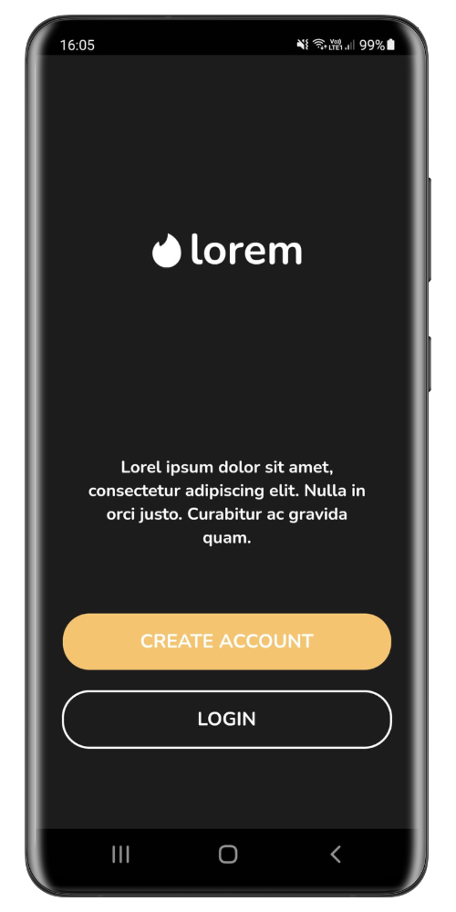
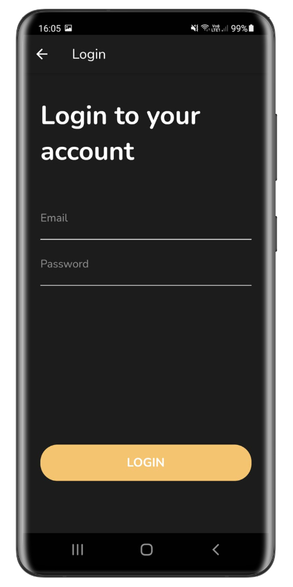
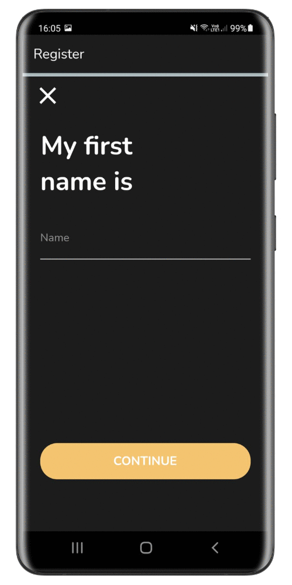
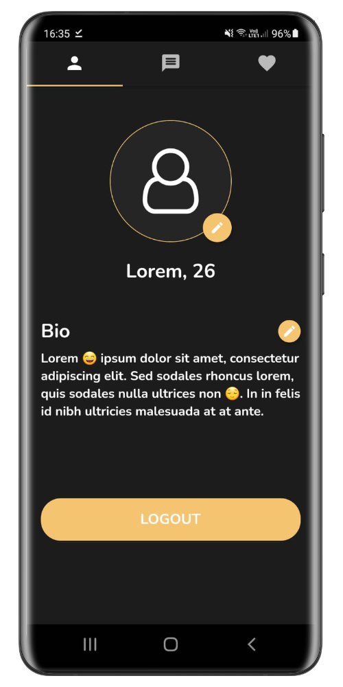
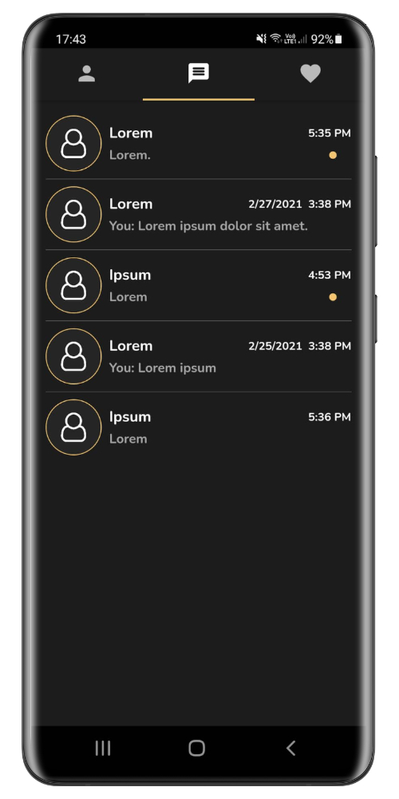
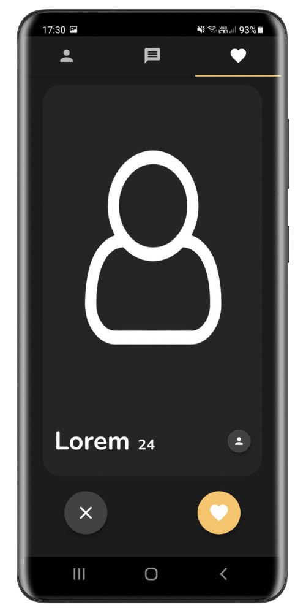
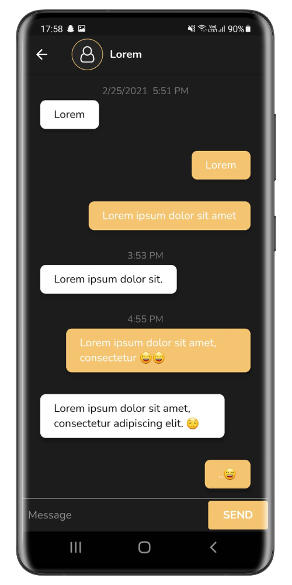
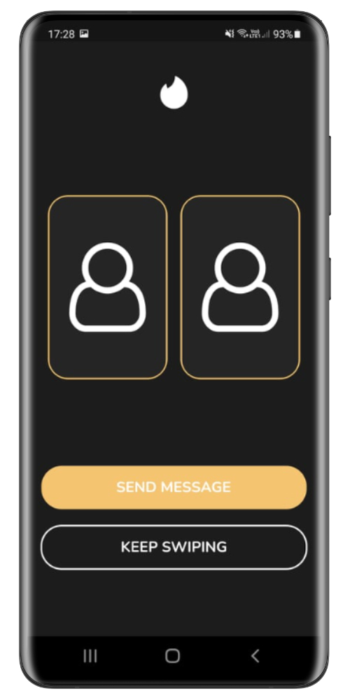
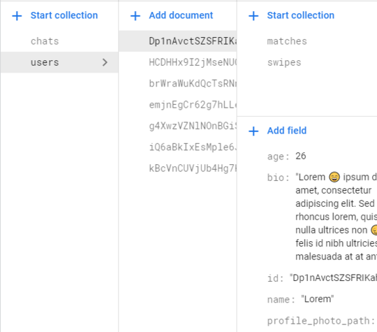
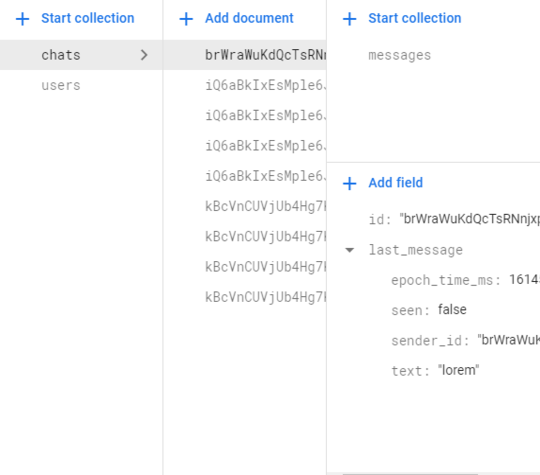

# Comprehensive Guide to Flutter-Based Dating App Development

## Overview

Welcome to an immersive journey into Flutter app development, demonstrated through a Dating-like application. This project serves as an educational tool for both beginners and seasoned developers, offering insights into Flutter's capabilities and integration with Firebase.

## Introduction

The application is designed as a practical Flutter learning project, with a focus on emulating the core features of the popular dating app, Dating. It currently supports Android devices.

## Core Technologies & Architectural Design

This project is built using Flutter, an open-source UI software development kit by Google, and Dart, a client-optimized language for fast apps on multiple platforms.

### Integration with Firebase:
- **Authentication:** Manages user identity and access.
- **Firestore:** A NoSQL database for storing and syncing data.
- **Storage:** Cloud storage solution for user-generated content like photos.

### Architectural Pattern:
- **Provider:** A mixture of dependency injection (DI) and state management, simplifying app development.

## Application Features

**User Interface:**
- **Start Screen:** Seamless user authentication including login and registration options.
- **Profile Screen:** Personalization features like image and bio updates, along with a logout function.
- **Chats Screen:** A comprehensive list of matches and chat conversations.
- **Chat Screen:** Real-time messaging with time-stamped messages.
- **Match Screen:** Swiping mechanism to like or dislike other users, with display of profiles.
- **Matched Screen:** Showcases users with whom a match has been made.

**Functionality:**
- **Auto Login:** Streamlines the user experience by remembering login status.
- **Basic Error Handling:** Ensures robust app performance.
- **Progress Indicators:** Enhances user experience during loading phases.

**Firebase Integration:**
- Stores and manages user profiles, chat data, and images.

## Visual Representation of App Features

### User Authentication Journey

  
   
   

### Main Application Screens

  
   
   

### Chat and Matched Screens

  
  

### Firebase Implementation

   
   

## Setting Up the Project

### Prerequisites
- Familiarity with Flutter and Android app development basics.
- Understanding of Firebase's core services.
- Flutter SDK, version 2.0.0 or higher.

### Configuring Firebase:
1. Initialize Authentication with 'Email/Password' sign-in method.
2. Set up Firestore for database management.
3. Configure Storage for handling user-generated content.
4. Replace the [google-services.json](android/app/google-services.json) file with your Firebase project credentials.

### Project Installation:
1. Download and import the project into an IDE like Android Studio.
2. Utilize an Android device or emulator to launch the application.

This comprehensive guide aims to provide a deeper understanding and practical application of Flutter through the lens of a Dating-like app, making it an ideal resource for both learning and reference.